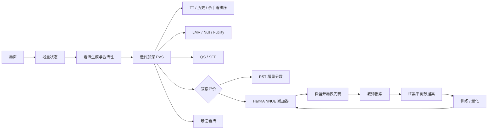
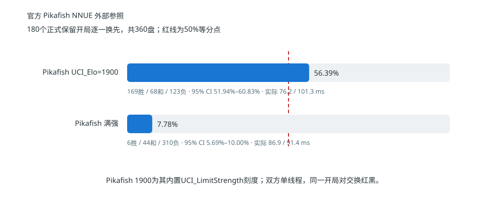
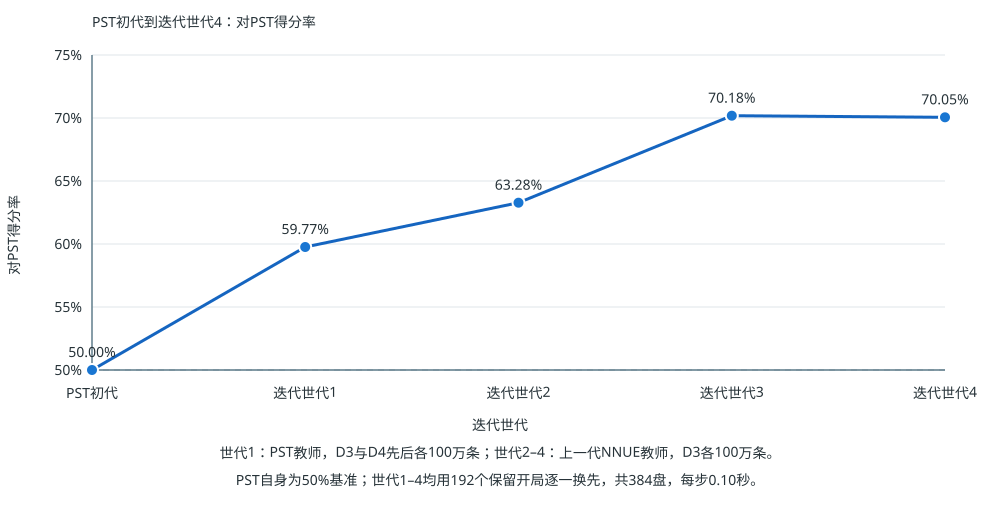

# 中国象棋 AI：增量搜索与量化 NNUE 技术报告

[在线对弈](http://47.102.137.220:8100) · [交互式教程](slides-formal-web-lite/index.html) · [运行说明](docs/RUNNING.md) · [实验设计](docs/EXPERIMENTS.md) · [NNUE 专题](trainnnue/README.md)

## 摘要

本项目从零实现了一套中国象棋搜索引擎，研究重点是普通 CPU、固定思考时间下的决策质量。系统以可逆增量状态为基础，将规则判断、PST/NNUE 评价、Zobrist 哈希与搜索路径统一到 `make_move()` / `undo_move()`；搜索端组合迭代加深、PVS、置换表、静态搜索、走法排序和选择性剪枝；评价端实现 HalfKA 特征、增量累加器与量化整数推理。

当前最佳模型采用 `XQ-HalfKA-9x14x90 → H16 → CReLU → 阶段输出头`，大小 363 KB。对官方 Pikafish 2026-01-31 NNUE 的外部测试表明：自研引擎对其内置 `UCI_Elo=1900` 档取得 **56.39%** 得分率；对满强版本取得 **7.78%**。内部等时测试中，NNUE 对自研 PST 基线取得 **70.18%**，量化了神经评价器带来的直接增益。

| 外部等强坐标 | 顶级引擎距离 | NNUE 内部增益 | 量化模型大小 |
|:---:|:---:|:---:|:---:|
| **vs Pikafish 1900：56.39%** | **vs 满强 Pikafish：7.78%** | **vs 自研 PST：70.18%** | **363 KB** |

## 1. 问题定义与技术贡献

项目围绕三个相互制约的问题展开：

1. 如何让棋盘及其派生状态在数百万次试走中精确、低成本地往返？
2. 如何利用走法排序、缓存和选择性搜索，在固定时间内完成更深的有效搜索？
3. 如何设计一个表达能力足够、推理成本足够低的神经评价器，使等时棋力获得提升？

对应的核心实现如下。

| 模块 | 实现 | 工程作用 |
|---|---|---|
| 增量状态 | 棋盘、棋子表、将帅位置、占位、PST、Hash、NNUE 累加器同步更新 | 降低搜索树内高频走子与评价成本 |
| 搜索 | 迭代加深、PVS、TT、QS/SEE、走法排序、LMR、Null Move、Futility | 在固定思考时间内完成更深的有效搜索 |
| 评价 | PST 基线与量化 HalfKA NNUE 双路径 | 直接测量神经评价相对手工评价的棋力增益 |
| 实验 | 平衡数据集、教师可配置、训练早停、配对统计、图表自动生成 | 保存从数据、模型到对局结论的完整链路 |
| 工程 | stdio 引擎协议、pygame、FastAPI/WebSocket、Pikafish 桥接 | 同一搜索核心服务本地交互、网页与批量实验 |

## 2. 系统设计



主搜索器保留 PST 与 NNUE 两条评价路径。教师搜索生成局面标签，训练结果量化后进入 C++ 推理器，经过等时比赛筛选的模型再用于下一轮数据生成。搜索、训练和对局因此形成可重复的闭环。

## 3. 增量状态与规则实现

局面由 `board[10][9] + turn` 表示，大写棋子属于红方，小写棋子属于黑方。七类棋子分别生成伪合法着，再通过试走、查将和撤销得到合法着法。

一次走子同时维护：

- 棋盘与双方棋子列表；
- 将帅坐标、行列占位和攻击查询所需状态；
- 材料与 PST 增量分数；
- Zobrist hash、重复局面与搜索路径；
- NNUE 双视角第一层累加器。

吃子时使用交换补洞保持棋子表连续。撤销操作恢复棋盘、索引、分数、哈希和累加器的原值，使搜索树中的兄弟分支共享同一套状态对象。浏览器与服务端共同校验人类着法，规则检查保持一致。

## 4. 静态评价

### 4.1 材料价值与 PST

PST 路线把每枚棋子的基础价值与所在格位置分相加，红方记正、黑方记负。`current_score` 在走子时完成增量更新：移除起点贡献、加入终点贡献，吃子时再移除目标棋子贡献，因此 `evaluate()` 可以直接返回缓存分数。

PST 为搜索提供常数时间评价，也构成神经评价器的残差基线。两条评价路线使用相同的局面、走法与搜索代码，直接比较集中在评价模块本身。

### 4.2 NNUE 网络结构

```text
XQ-HalfKA-9x14x90 → H16 → CReLU → 阶段输出头 → PST 残差
```

- **输入特征**：以本方将帅为锚点，组合 9 个将位桶、14 个相对阵营/棋子通道和 90 个格点。
- **双视角**：红黑双方分别定向，同一组特征权重共享使用。
- **隐藏层**：宽度 `H=16`，采用截断 ReLU。
- **输出**：预测相对 PST 的修正量，并按局面阶段选择输出参数。
- **推理**：模型量化后由 C++ 整数路径执行，文件大小 363,128 bytes。

### 4.3 增量累加器

第一层计算结果缓存在引擎对象的双视角累加器中。普通走子只减去源格特征、加入目标格特征，并在吃子时减去被吃棋子特征；将帅移动触发对应锚点视角重建。`undo_move()` 执行严格逆更新，`null move` 只改变待走方。

该设计把高维稀疏层的计算从“每次评价扫描全部棋子”改为“每次走子更新发生变化的特征”，使 NNUE 能够进入静态搜索的高频评价路径。

### 4.4 训练与教师迭代

初代训练数据由无风险剪枝的 PST 教师搜索生成，并对红黑待走局面进行平衡。后续迭代把教师配置切换为上一代量化 NNUE 加 D3 搜索，每代重新生成 100 万条局面。Sigmoid 温度 `K` 由数据独立统计后冻结；模型训练、量化导出和 C++ 校验由同一流水线完成。

## 5. 完整搜索

搜索器从 Minimax 递归出发：红方选择最高分支，黑方选择最低分支，叶节点调用静态评价。工程实现以限时迭代加深为外层框架，从浅到深重复搜索，并始终保存最近一次完整深度的最佳着与分数。

| 机制 | 保存或计算的内容 | 搜索收益 |
|---|---|---|
| Alpha-Beta / PVS | 当前分数窗口 | 截断无法改变上层选择的分支 |
| Aspiration Window | 围绕上一深度分数的窄窗口 | 提高常见稳定局面的截断效率 |
| Zobrist Hash / TT | 深度、分数、边界类型、最佳着 | 复用置换局面并提供首选着法 |
| Quiescence Search | 吃子、将军等强制变化 | 把叶节点推进到更稳定的局面 |
| SEE | 目标格连续交换的静态收益 | 改善吃子排序与静态搜索效率 |

置换表中的分数已经包含对应叶节点的 PST 或 NNUE 评价；命中时按保存深度和边界类型参与当前搜索。迭代加深产生的主变化与 TT move 又为下一深度提供排序信息。

## 6. 选择性搜索与时间管理

完整宽度随深度指数增长，选择性搜索依据局面类型和走法次序分配节点预算。

| 类别 | 方法 | 决策依据 |
|---|---|---|
| 走法排序 | TT Move、MVV-LVA、Killer、Counter Move、History | 历史搜索与战术价值 |
| 深度缩减 | LMR、LMP | 排名靠后、深度和局面安静程度 |
| 前向剪枝 | Null Move、Futility、Reverse Futility、Razoring | 静态分数与 Alpha-Beta 窗口距离 |
| 恢复机制 | 窄窗口失败后重搜、关键着完整深度 | 搜索结果越过当前界限 |

时间管理在节点循环中检查截止时间，迭代边界负责提交完整结果。训练教师使用相同规则、评价和静态搜索，同时关闭依赖经验假设的前向剪枝，为固定深度监督标签提供稳定计算路径。

## 7. 实验设计

### 7.1 对局协议

| 项目 | 内部 PST / NNUE 对照 | 官方 Pikafish 外部参照 |
|---|---|---|
| 开局 | 192 个保留开局 | 12 个校准开局 + 180 个正式开局 |
| 颜色控制 | 每个开局逐一换先 | 每个开局逐一换先 |
| 正式盘数 | 384 盘 / 组 | 360 盘 / 档位 |
| 资源 | 单 CPU 核 | 双方单线程、每盘固定同一逻辑核 |
| 名义时限 | 双方每步 0.10 秒 | 自研 0.25 秒；Pikafish 0.10 秒 |
| 实际平均用时 | 同一搜索器直接对照 | 1900档：76.2 / 101.3 ms；满强：86.9 / 91.4 ms |
| 得分率 | `(胜局 + 0.5 × 和局) / 总局数` | 同左 |
| 区间估计 | 按开局对 bootstrap 95% CI | 同左 |

自研引擎在完成一层后使用 `0.16` 经验阈值判断下一完整深度的成本，因此名义时限与实际搜索时间存在固定差异。前 12 个开局用于冻结时间倍率和 Pikafish 限强档位；其余 180 个开局构成正式外部测试集。正式赛中自研引擎的实际平均用时低于 Pikafish。`UCI_Elo=1900` 是 Pikafish `UCI_LimitStrength` 的内置刻度。

## 8. 实验结果

### 8.1 官方 Pikafish 外部参照



| 官方对手 | 自研胜 / 和 / 负 | 自研得分率 | 配对 95% CI | 实际平均用时（自研 / Pikafish） |
|---|---:|---:|---:|---:|
| **Pikafish `UCI_Elo=1900`** | **169 / 68 / 123** | **56.39%** | **51.94%–60.83%** | **76.2 / 101.3 ms** |
| Pikafish 满强 | 6 / 44 / 310 | 7.78% | 5.69%–10.00% | 86.9 / 91.4 ms |

第一行给出当前引擎的外部等强坐标：在 Pikafish 内置 1900 档之上。第二行给出与完整强度官方 NNUE 引擎的距离。两组比赛使用同一批 180 个正式开局、逐一换先和配对统计；官方二进制与网络文件的 SHA-256 写入结果 JSON。

### 8.2 NNUE 代际结果



| 迭代世代 | 教师与数据 | 对 PST 得分率 | 胜 / 和 / 负 |
|---:|---|---:|---:|
| PST 初代 | PST 基线 | 50.00% | 基准 |
| 1 | PST D3、D4 各 100 万条 | 59.77% | 172 / 115 / 97 |
| 2 | 上一代 NNUE + D3，100 万条 | 63.28% | 188 / 110 / 86 |
| **3** | **上一代 NNUE + D3，100 万条** | **70.18%** | **218 / 103 / 63** |
| 4 | 上一代 NNUE + D3，100 万条 | 70.05% | 224 / 90 / 70 |

第三世代取得最高实测得分率，配对 95% CI 为 **66.80%–73.44%**，当前网页与本地 NNUE 入口均使用该模型。第四世代与第三世代进入同一性能平台，代际实验由此完成。

### 8.3 网络宽度与搜索成本

在相同条件下，D4-H16 对 D4-H8 得分率为 **54.17%**，平均完成深度为 **9.18 vs 9.24**。H16 的额外评价成本保持在很小的深度差内，同时获得直接对局优势，因此成为最终宽度。

完整离线指标、训练曲线、瑞士轮排名、逐代对局和 checkpoint 信息集中在 [trainnnue/README.md](trainnnue/README.md) 与自动生成的 [RESULTS.generated.md](trainnnue/RESULTS.generated.md)。

## 9. 可复现性

### 9.1 运行引擎

完整环境、模型版本、编译参数与环境变量见 [docs/RUNNING.md](docs/RUNNING.md)。网页端最短运行路径：

```powershell
python -m pip install -r requirements.txt
python webapp.py
# http://localhost:8000
```

桌面端运行：

```powershell
python gui.py
```

### 9.2 实验入口

| 任务 | 命令 / 脚本 | 产物 |
|---|---|---|
| 引擎 A/B 回归 | `python ab_selfplay.py baseline.exe candidate.exe` | 分时间档日志与汇总 JSON |
| 官方 Pikafish 外部赛 | `trainnnue/run_external_match.ps1` | 换先逐盘结果、实际耗时与配对 CI |
| NNUE 换先赛 | `python trainnnue/engine_match.py ...` | 逐盘 JSON、得分率、配对 CI |
| 多模型瑞士轮 | `python trainnnue/swiss_tournament.py` | 排名与交手记录 |
| 教师迭代 | `trainnnue/run_teacher_iteration.ps1` | 数据、模型、校验与对局产物 |
| 重建结果 | `python trainnnue/report_results.py` | Markdown 表格与 SVG 曲线 |
| 自动测试 | `python -m pytest tests -q` | 规则与 WebSocket 测试结果 |

保存的 JSON 结果可以一键生成 [实验汇总](trainnnue/RESULTS.generated.md)、[外部基准图](trainnnue/external_benchmark.svg)、[训练曲线](trainnnue/training_curve.svg)和[代际棋力曲线](trainnnue/iteration_vs_pst.svg)，使数字、表格与图片保持同源。具体 A/B 协议见 [docs/EXPERIMENTS.md](docs/EXPERIMENTS.md) 和 [AB_SELFPLAY.md](AB_SELFPLAY.md)。

## 10. 工程接口

搜索核心通过简洁的 stdio 协议与外围程序通信，同一引擎可用于本地界面、网页会话和批量实验。网页端通过 FastAPI/WebSocket 管理独立对局，可切换自研 NNUE、自研 PST 与 Pikafish PST；`pikafish_bridge.py` 负责 UCI 协议转换；[`deploy/deploy.ps1`](deploy/deploy.ps1) 负责远程同步、编译、模型上传、服务重启和 HTTP 检查。

| pygame 棋盘 | 搜索深度、分数、节点与主变化日志 |
|:---:|:---:|
|  |  |

## 11. 仓库结构

| 路径 | 内容 |
|---|---|
| [`xiangqi_ai.cpp`](xiangqi_ai.cpp) | PST 评价、增量状态与主搜索器 |
| [`trainnnue/`](trainnnue/) | 数据生成、训练、量化、校验、比赛与模型 |
| [`common.py`](common.py) | 共享规则、云开局库与引擎进程通信 |
| [`gui.py`](gui.py) | pygame 交互界面 |
| [`webapp.py`](webapp.py), [`static/`](static/) | FastAPI/WebSocket 交互接口 |
| [`tests/`](tests/) | 规则、云库、会话与网页测试 |
| [`deploy/`](deploy/) | Linux 服务配置与部署脚本 |
| [`slides-formal-web-lite/`](slides-formal-web-lite/) | 从规则、评价到搜索和 NNUE 的交互式教程 |

## 12. 下一阶段实验

- 扩展多时间控制的大规模换先赛，建立稳定的 Elo 测量基准。
- 补全平台级长捉、长杀裁决与对应局面测试集。
- 继续优化 NNUE 累加器、整数推理和搜索协同效率。
- 比较更丰富的轻量输出头与当前 H16 结构的等时收益。
