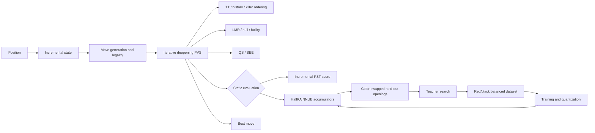
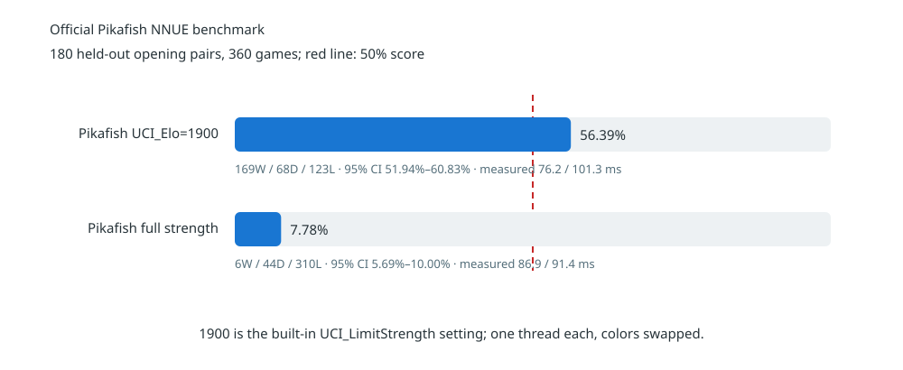
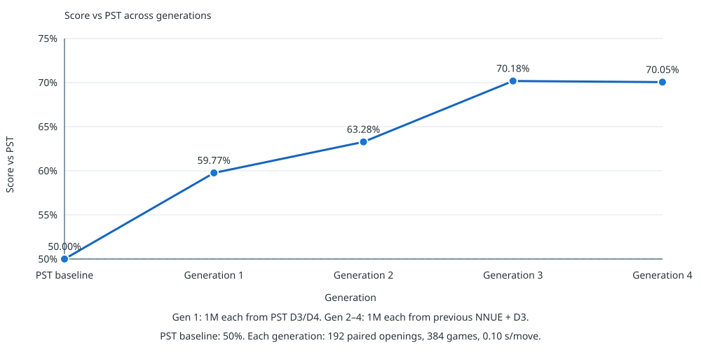
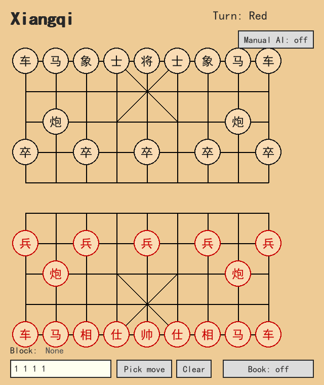
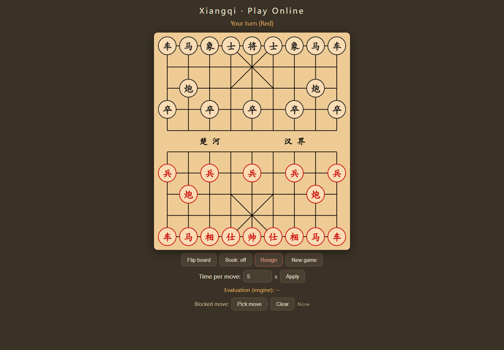

# Xiangqi AI: Incremental Search and Quantized NNUE

[English](README.md) · [简体中文](README_zh.md)

[Play online](http://164.152.167.211:8100/) · [Interactive tutorial](slides-formal-web-lite/index.html) · [Tutorial PDF](slides-formal-web-lite/xiangqi-engine-tutorial.pdf) · [Running the project](docs/RUNNING.md) · [Experiments](docs/EXPERIMENTS.md) · [NNUE details](trainnnue/README.md)

## Overview

A Chinese chess engine built from scratch, focused on decision quality on ordinary CPUs under fixed thinking times. Reversible incremental state connects move legality, PST/NNUE evaluation, Zobrist hashing, and search history through `make_move()` / `undo_move()`. The search combines iterative deepening, PVS, transposition tables, quiescence search, move ordering, and selective pruning. Neural evaluation uses HalfKA features, incremental accumulators, and quantized integer inference.

The selected **363 KB** model uses **XQ-HalfKA-9x14x90 → H16 → CReLU → phase-specific output heads**. It scored **70.18%** against the project's PST baseline in internal equal-time matches. Results against three historical engines imply **2369–2452 Elo**, placing it around **2400 Elo, at human-master level on the cited reference scale**.

| Opponent | Our wins / draws / losses (score rate) | Implied Elo |
|---|---:|---:|
| [ElephantEye 3.1](trainnnue/iter2_vs_eleeye31_180pairs.json) | 290 / 31 / 39 (84.86%) | ≈2430 |
| [Tianqi V1.1.8](trainnnue/iter2_vs_tianqi118_180pairs.compact.json) | 109 / 79 / 172 (41.25%) | ≈2369 |
| [Cyclone 2007C](trainnnue/iter2_vs_cyclone2007c_180pairs.compact.json) | 60 / 95 / 205 (29.86%) | ≈2452 |
| [Pikafish 2026-01-31 · UCI_Elo=1900](trainnnue/iter2_vs_pikafish_elo1900_180pairs.json) | 169 / 68 / 123 (56.39%) | ≈1945 (limited-strength scale) |
| [Pikafish 2026-01-31 · full strength](trainnnue/iter2_vs_pikafish_official_180pairs.json) | 6 / 44 / 310 (7.78%) | ≈3573 (cross-generation comparison) |

Reference ratings come from a [public Xiangqi engine rating list](https://zhuanlan.zhihu.com/p/2072972857840350627). The conversion is `opponent reference Elo + 400 × log10(score / (1 − score))`, with reference ratings 2130.4, 2430, 2600, and 4002.7 for ElephantEye, Tianqi, Cyclone, and full-strength Pikafish. Pikafish 1900 uses its built-in strength-limiting scale. See the [results report](trainnnue/RESULTS.generated.md) for game records, measured times, executable hashes, and reproduction commands.

## 1. Questions and implementation

1. How can board state and derived values be updated and restored accurately and cheaply across millions of trial moves?
2. How can ordering, caching, and selective search produce deeper useful analysis within a fixed time budget?
3. How can neural evaluation balance expressive power and inference cost to improve equal-time strength?

| Component | Implementation | Purpose |
|---|---|---|
| Incremental state | Board, piece lists, kings, occupancy, PST, hash, NNUE accumulators | Reduce move and evaluation cost |
| Search | Iterative deepening, PVS, TT, QS/SEE, ordering, LMR, null move, futility | Search useful lines more deeply |
| Evaluation | PST baseline and quantized HalfKA NNUE | Measure gains from neural evaluation |
| Experiments | Balanced data, configurable teachers, early stopping, paired statistics, generated figures | Trace conclusions to data, models, and games |
| Integration | stdio, pygame, FastAPI/WebSocket, Pikafish bridge | Share one search core across clients and experiments |

## 2. System design


```mermaid
flowchart LR
    POS[Position] --> STATE[Incremental state]
    STATE --> MOVE[Move generation and legality]
    MOVE --> SEARCH[Iterative deepening PVS]
    SEARCH --> ORDER[TT / history / killer ordering]
    SEARCH --> PRUNE[LMR / null / futility]
    SEARCH --> QS[QS / SEE]
    SEARCH --> EVAL{Static evaluation}
    EVAL --> PST[Incremental PST score]
    EVAL --> NNUE[HalfKA NNUE accumulators]
    SEARCH --> BEST[Best move]
    TEACHER[Teacher search] --> DATA[Red/black balanced dataset]
    DATA --> TRAIN[Training and quantization]
    TRAIN --> NNUE
    NNUE --> MATCH[Color-swapped held-out openings]
    MATCH --> TEACHER
```

Teacher search labels positions; trained models are quantized for C++ inference; models selected through equal-time matches become teachers for subsequent data generation. Search, training, and matches form a reproducible cycle.

## 3. Incremental state and rules

Positions use `board[10][9] + turn`, with uppercase pieces for Red and lowercase pieces for Black. Seven piece types generate pseudo-legal moves, filtered by making each move, checking king safety, and undoing it.

Each move updates the board and piece lists, king coordinates, row/column occupancy and attack state, material/PST scores, Zobrist hash and repetition history, and both NNUE accumulators. Captures keep piece lists contiguous through swap removal. Undo restores every derived value, allowing sibling branches to reuse one state object. Both browser and server validate human moves.

## 4. Static evaluation

### Material and piece-square tables

PST evaluation adds material value and a square bonus, positive for Red and negative for Black. `current_score` is updated by removing the source contribution, adding the destination contribution, and removing any captured piece. `evaluate()` returns the cached score in constant time.

PST also serves as the residual baseline for NNUE. Both evaluation paths share position, move, and search code, concentrating comparisons on evaluation.

### NNUE architecture

```text
XQ-HalfKA-9x14x90 → H16 → CReLU → phase-specific output head → PST residual
```

- **Features:** 9 king-position buckets × 14 relative side/piece channels × 90 squares.
- **Perspectives:** separately oriented Red and Black views share one weight table.
- **Width:** `H=16`, with clipped ReLU.
- **Output:** a correction to PST, with parameters selected by game phase.
- **Inference:** C++ integer arithmetic; the quantized model occupies 363,128 bytes.

### Incremental accumulators

The first layer is cached in two perspective accumulators. Ordinary moves subtract the source feature and add the destination feature; captures also subtract the captured piece. King moves rebuild the affected anchored perspective. `undo_move()` reverses updates exactly; null moves change only the side to move. Updating changed features makes NNUE practical in the high-frequency quiescence path.

### Training and teacher iteration

Initial data comes from PST teacher search with heuristic forward pruning disabled, balanced by side to move. Later iterations use the previous quantized NNUE with depth-3 search, generating one million new positions per iteration. Sigmoid temperature `K` is calibrated separately and frozen. Training, quantization, and C++ validation share one pipeline.

## 5. Search

Minimax maximizes for Red and minimizes for Black, evaluating leaf positions statically. Timed iterative deepening increases depth while retaining the best move and score from the latest completed iteration.

| Mechanism | Information | Benefit |
|---|---|---|
| Alpha-beta / PVS | Current score window | Cut branches that cannot affect the parent choice |
| Aspiration window | Narrow window around the previous score | Improve cutoff efficiency in stable positions |
| Zobrist hash / TT | Depth, score, bound type, best move | Reuse transpositions and prioritize promising moves |
| Quiescence search | Captures, checks, forcing continuations | Reach more stable leaf positions |
| SEE | Static gain from exchanges on a square | Improve capture ordering and quiescence efficiency |

TT scores include the chosen leaf evaluator and are reused according to saved depth and bound type. Principal variations and TT moves improve ordering for the next iteration.

## 6. Selective search and time management

| Category | Methods | Basis |
|---|---|---|
| Ordering | TT move, MVV-LVA, killer, counter move, history | Previous searches and tactical value |
| Reduction | LMR, LMP | Late move order, depth, quietness |
| Forward pruning | Null move, futility, reverse futility, razoring | Static score relative to the search window |
| Recovery | Re-search after failed narrow windows; full depth for critical moves | Results crossing current bounds |

Deadline checks occur in the node loop; completed results are committed at iteration boundaries. The teacher shares rules, evaluation, and quiescence but disables heuristic forward pruning to produce consistent fixed-depth labels.

## 7. Experimental design

| Setting | Internal PST / NNUE | Official Pikafish reference |
|---|---|---|
| Openings | 192 held-out openings | 12 calibration + 180 formal openings |
| Color control | Swap colors for every opening | Same |
| Games | 384 per comparison | 360 per strength setting |
| Resources | One CPU core | One thread each, same logical core per game |
| Nominal time per move | 0.10 s each | Our engine 0.25 s; Pikafish 0.10 s |
| Mean measured time | Shared searcher for direct comparison | Limited: 76.2 / 101.3 ms; full: 86.9 / 91.4 ms |
| Score rate | `(wins + 0.5 × draws) / games` | Same |
| Uncertainty | Opening-pair bootstrap 95% CI | Same |

Our engine uses a `0.16` heuristic threshold after each completed depth to estimate the next iteration's cost. This creates a systematic difference between nominal and actual time. The first 12 openings freeze the time multiplier and Pikafish strength setting; the other 180 form the formal test set. Our measured mean time is lower in the formal Pikafish matches. `UCI_Elo=1900` is Pikafish's built-in `UCI_LimitStrength` scale.

## 8. Results

### External matches



The table above reports all external results. Each match uses 180 color-swapped opening pairs (360 games) with fixed CPU affinity. Mean measured times (our engine / opponent) are 104.0 / 119.4 ms for ElephantEye, 155.0 / 159.6 ms for Tianqi, 112.4 / 89.9 ms for Cyclone, 76.2 / 101.3 ms for limited Pikafish, and 86.9 / 91.4 ms for full-strength Pikafish. Our engine used about 25% more time against Cyclone; the table retains that original condition.

### Model generations



| Generation | Teacher and data | Score vs PST | Wins / draws / losses |
|---:|---|---:|---:|
| PST baseline | PST | 50.00% | Reference |
| 1 | PST D3 and D4, one million positions each | 59.77% | 172 / 115 / 97 |
| 2 | Previous NNUE + D3, one million positions | 63.28% | 188 / 110 / 86 |
| **3** | **Previous NNUE + D3, one million positions** | **70.18%** | **218 / 103 / 63** |
| 4 | Previous NNUE + D3, one million positions | 70.05% | 224 / 90 / 70 |

Generation 3 (`Iter2-NNUE-D3`) has the highest observed score, with paired 95% CI **66.80%–73.44%**, and is selected for the web and local NNUE entry points. Generation 4 reaches the same performance plateau, ending this iteration experiment.

### Width and search cost

D4-H16 scored **54.17%** against D4-H8, with mean completed depths of **9.18 vs 9.24**. H16 adds little depth cost while improving direct-match performance, so it is the selected width. Offline metrics, curves, Swiss standings, matches, and checkpoints are in the [NNUE guide](trainnnue/README.md) and [generated report](trainnnue/RESULTS.generated.md).

## 9. Reproduction

See [docs/RUNNING.md](docs/RUNNING.md) for environments, compilation, model versions, and configuration.

```powershell
python -m pip install -r requirements.txt
python webapp.py
# Open http://localhost:8000
```

Desktop client:

```powershell
python gui.py
```

| Task | Command / script | Output |
|---|---|---|
| A/B regression | `python ab_selfplay.py baseline.exe candidate.exe` | Logs by time control and summary JSON |
| Official Pikafish | `trainnnue/run_external_match.ps1` | Paired games, measured times, CI |
| ElephantEye 3.1 | `trainnnue/run_eleeye_match.ps1` | UCCI bridge and single-core paired games |
| Cyclone 2007C | `trainnnue/run_cyclone_match.ps1` | Cyclone UCI bridge and legality audits |
| Tianqi V1.1.8 | `trainnnue/run_tianqi_match.ps1` | UCI bridge and legality audits |
| NNUE matches | `python trainnnue/engine_match.py ...` | Game JSON, score rates, paired CI |
| Swiss tournament | `python trainnnue/swiss_tournament.py` | Standings and pairings |
| Teacher iteration | `trainnnue/run_teacher_iteration.ps1` | Data, models, validation, matches |
| Rebuild reports | `python trainnnue/report_results.py` | Markdown tables and SVG plots |
| Tests | `python -m pytest tests -q` | Rules and WebSocket checks |

Saved JSON regenerates the results and figures from one source. See [experiment design](docs/EXPERIMENTS.md) and the [A/B guide](AB_SELFPLAY.md) for protocols.

## 10. Interfaces

A compact stdio protocol connects the search core to clients and batch experiments. FastAPI/WebSocket manages independent games and offers the project's NNUE and PST engines plus Pikafish PST. `pikafish_bridge.py` translates UCI. [`deploy/deploy.ps1`](deploy/deploy.ps1) handles synchronization, compilation, model upload, service restart, and HTTP checks.

| Desktop board | Web application |
|:---:|:---:|
|  |  |

## 11. Repository layout

| Path | Contents |
|---|---|
| [`xiangqi_ai.cpp`](xiangqi_ai.cpp) | PST evaluation, incremental state, main searcher |
| [`trainnnue/`](trainnnue/) | Data generation, training, quantization, validation, matches, models |
| [`common.py`](common.py) | Shared rules, cloud opening book, engine communication |
| [`gui.py`](gui.py) | pygame desktop interface |
| [`webapp.py`](webapp.py), [`static/`](static/) | FastAPI/WebSocket web interface |
| [`tests/`](tests/) | Rules, cloud book, sessions, web tests |
| [`deploy/`](deploy/) | Linux service configuration and deployment |
| [`slides-formal-web-lite/`](slides-formal-web-lite/) | Interactive tutorial and downloadable PDF |
