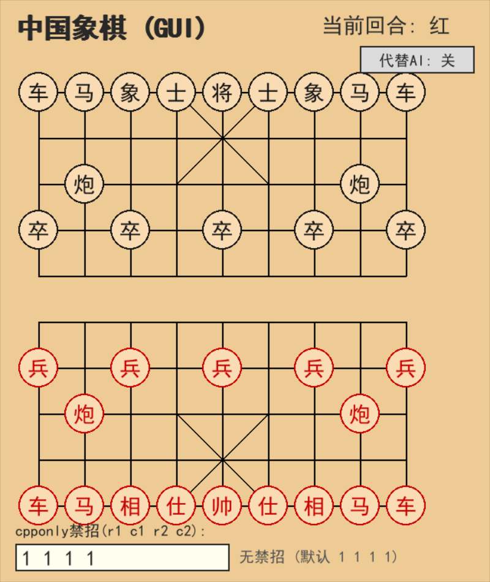
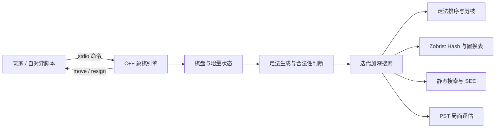
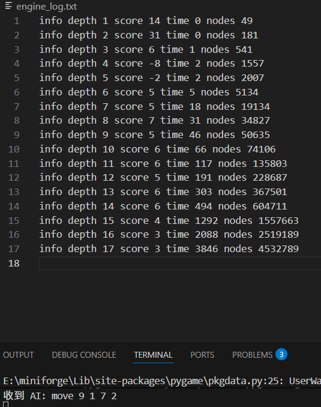

# 让机器多想几步：一个业余中国象棋 AI 的进化过程

> 分享对象：对项目感兴趣的开发同事  
> 建议时长：30 分钟分享 + 10 分钟交流  
> 核心源码：[`xiangqi_ai.cpp`](xiangqi_ai.cpp)

## 开场：它不会下棋，只是很会搜索

这是一个用 C++ 编写的中国象棋 AI。

它没有使用大模型，也没有训练神经网络。它所做的事情很朴素：

1. 枚举当前可以走的棋；
2. 假设双方都尽量走出对自己最有利的一步；
3. 尽可能多向后推演几层；
4. 在时间耗尽前，选择目前看来最好的走法。

听起来只是“暴力枚举”，但真正做起来，问题很快就变成：

> 如何在同样的一秒钟里，少看无意义的分支，多看几步真正重要的变化？

这个问题也是整个项目的主线。



---

## 一、项目是怎样长出来的

从 Git 历史看，这个项目并不是一次设计完成的，而是经历了多次试验和重写。

| 时间 | 版本节点 | 当时解决的问题 |
| --- | --- | --- |
| 2026-02-07 | 第一批提交 | 用 Python 搭出可以运行的原型 |
| 2026-02-10 | `尝试学pst表` | 尝试从局面与分数数据中学习位置表，但效果没有达到预期 |
| 2026-02-11 | `加入中残、攻势两套pst，参考象眼` | 丰富静态评估，探索不同阶段的位置价值 |
| 2026-02-11 | `将军延申好优化，裕度裁剪差` | 发现搜索优化并非越多越好，需要通过对局判断收益 |
| 2026-02-11 | `维护将帅检测优化` | 将频繁计算改为增量维护和更直接的攻击检测 |
| 2026-02-11 | `修马腿对王坐标` | 修复中国象棋规则实现中的坐标错误 |
| 2026-02-12 | `有可用的CPP版` | 核心引擎迁移到 C++，形成可用版本 |
| 2026-05-26 | `增加工程效率增加深度` | 加入一批搜索与数据结构优化，自测可战胜固定深度 7 的皮卡鱼 |
| 2026-08-21 | A/B 自对弈工具 | 开始用 baseline/candidate 换先对局验证修改 |

这段历史里有一个很真实的规律：

> AI 帮忙写代码可以很快，但规则漏洞、搜索边界和实验结论仍然需要自己验证。

例如，“马腿相对将帅坐标”只是一个很小的坐标关系，写错后程序仍能正常运行，甚至还能下棋，但它对局面的理解已经悄悄错了。这类问题往往比编译错误更危险。

---

## 二、从界面到搜索树：项目全貌



当前核心源码约 1767 行。外围还有三种使用方式：

- `gui.py`：本地图形界面；
- `webapp.py`：FastAPI + WebSocket 网页版；
- `selfplay.py`、`ab_selfplay.py`、`cross_arena.py`：自对弈和外部引擎测试。

引擎没有依赖复杂协议，而是通过标准输入输出接收简单命令：

```text
ready
side red
move 7 7 4 7
search
```

输出类似：

```text
readyok
move 2 1 2 4
```

这种边界很有用：界面、网页、自对弈工具都不需要知道搜索内部如何实现。

---

## 三、第一层基础：怎样表示一盘棋

棋盘直接表示为 10×9 的字符数组：

```cpp
char board[10][9];
```

大写字母表示红方，小写字母表示黑方，例如：

```text
r n b a k a b n r
. . . . . . . . .
. c . . . . . c .
p . p . p . p . p
...
R N B A K A B N R
```

只有棋盘数组还不够。搜索会反复执行“走一步—继续搜索—撤销”，这些操作可能发生数百万次，因此引擎还同时维护：

- 当前局面分数 `current_score`；
- 当前 Zobrist 哈希 `current_hash`；
- 双方将帅位置 `king_pos`；
- 双方仍在棋盘上的棋子列表；
- 每行、每列以及双方各自的占位掩码；
- 搜索路径上的局面、着法和将军记录。

它们都由 `make_move()` 与 `undo_move()` 增量更新。

### 为什么不每次重新扫描棋盘

假设每个搜索节点都重新遍历 90 个格子，单次看起来不贵；但节点数达到百万级后，重复工作会被放大。

增量维护的思路是：一次走子只影响源格和目标格，因此只更新真正变化的数据。

代价也很明显：

> `make_move()` 改了什么，`undo_move()` 就必须一项不漏地恢复什么。

分数、哈希、棋子索引或占位中任何一项没有恢复，错误都可能在搜索到很深以后才表现出来。

---

## 四、中国象棋的规则，比棋盘尺寸更麻烦

走法生成需要处理每种棋子的特殊规则：

- 马会被“蹩马腿”；
- 象不能过河，还会被“塞象眼”；
- 炮吃子时必须隔一个炮架；
- 将帅只能在九宫内移动；
- 将帅不能直接照面；
- 兵过河后才可以横走。

当前引擎先生成“伪合法着法”，再试走并检查己方是否仍被将军。这样可以把“棋子怎么走”和“走完是否合法”分开处理。

车和炮的直线攻击使用预计算表：

```cpp
uint16_t ROOK_ROW_ATT[9][512];
uint16_t ROOK_COL_ATT[10][1024];
uint16_t CANNON_ROW_ATT[9][512];
uint16_t CANNON_COL_ATT[10][1024];
```

输入是源位置和当前行列占位，输出是攻击掩码。运行时不必每次从头沿四个方向逐格扫描。

### 一个典型 Bug：程序能运行，不代表规则正确

Git 历史中专门有一次“修马腿对王坐标”。这类错误的危险在于：

- 不会导致编译失败；
- 大多数局面看起来正常；
- 只有特定将军关系下才出现；
- 搜索可能在错误的合法着法集合上继续得出一个“合理答案”。

因此棋类程序不能只测试“有没有输出”，还要测试特殊规则和战术局面。

---

## 五、它如何判断一个局面好不好

当前版本的静态评估入口非常简单：

```cpp
int evaluate() { return current_score; }
```

真正的工作在走子时已经完成。每个棋子的价值由“基础子力价值 + 位置表修正”构成：

```cpp
int total = val + pst_val;
return red ? total : -total;
```

可以把 PST（Piece-Square Table）理解成一张“棋子站在哪里更舒服”的表。例如：

- 兵过河后价值通常上升；
- 马在灵活的位置比缩在边角更好；
- 将帅的位置更受九宫和安全性约束。

这里需要强调一个容易误解的地方：当前源码最终使用的是一套增量位置分数，而不是神经网络，也不是读取开局库后直接照谱走。

这种评估很快，但它不真正理解复杂的棋形、攻王、子力协同与残局知识。这也是当前棋力上限的重要来源。

---

## 六、Minimax：假设对手也会走最好的一步

如果红方希望分数越高越好，黑方希望分数越低越好，那么搜索过程可以写成：

```text
红方节点：从所有子节点中取最大值
黑方节点：从所有子节点中取最小值
到达深度上限：使用静态评估值
```

问题是分支数会指数增长。假设平均每个局面有 35 种走法：

| 深度 | 粗略节点数 |
| ---: | ---: |
| 1 | 35 |
| 2 | 1,225 |
| 4 | 1,500,625 |
| 6 | 约 18 亿 |

真实搜索会因为吃子、将军和剪枝而不同，但指数爆炸不会消失。

所以引擎优化的本质不是“把所有分支算得更快”，而是：

> 证明大量分支不可能影响最终选择，于是不用继续搜索它们。

---

## 七、Alpha-Beta：第一个真正改变数量级的优化

Alpha-Beta 在搜索时维护一个当前可接受的分数窗口：

- `alpha`：红方目前至少能保证的分数；
- `beta`：黑方目前至多会允许的分数。

一旦某个分支已经不可能改变上层决策，就停止继续展开。

它不改变完整 Minimax 的结果，但性能高度依赖走法顺序：越早搜索到好着，越容易剪掉后面的差着。

当前引擎综合使用以下信息排序：

1. 置换表记录的最佳着法；
2. 吃子着法及 SEE；
3. Killer Move；
4. Counter Move；
5. History Heuristic。

这带来一个很有意思的结论：

> “先猜哪一步更好”即使不直接提高评估质量，也能让程序在相同时间内搜索得更深。

---

## 八、当前搜索栈里还有什么

### 1. 迭代加深

程序依次搜索深度 1、2、3……，而不是一开始就搜索一个很深的固定深度。

好处是：

- 时间到时，总能返回上一轮已经完成的结果；
- 浅层结果可以帮助下一层排序；
- 可以逐步收窄搜索窗口。

### 2. Zobrist Hash 与置换表

不同走子顺序可能到达同一个局面。Zobrist Hash 为局面生成一个 64 位标识，置换表保存已经搜索过的深度、分数边界和最佳走法。

这样再次遇到同一局面时，可以直接复用结果，或者至少优先搜索上次的最佳着法。

当前配置为 `2^23`，也就是约 800 万个置换表槽位。

### 3. 静态搜索（Quiescence Search）

如果刚好在“车吃马、炮再吃车”的中间停止搜索，静态评估会看到一个不稳定的假象。

静态搜索会在普通深度结束后继续检查关键吃子和将军，直到局面相对安静，从而缓解“地平线效应”。

### 4. SEE（Static Exchange Evaluation）

SEE 快速估算一个目标格上的连续交换是否划算，用于吃子排序和剪掉明显亏损的交换。

源码中仍保留了一个历史问题的棋盘复现样例。这也是项目中很典型的一类调试：问题不是“这个子能不能吃”，而是连续交换后，攻击者集合和占位掩码是否随棋盘变化正确更新。

### 5. 更激进的剪枝

当前代码还包含：

- Null Move Pruning（空步裁剪）；
- LMR（后着缩减）；
- LMP（后着裁剪）；
- Futility Pruning 与 Reverse Futility Pruning；
- Razoring；
- IID（内部迭代加深）；
- Aspiration Window（期望窗口）；
- PVS 风格的窄窗口重搜。

这些技术的共同假设是：某些分支大概率不重要，可以先少搜、浅搜或不搜；如果后来发现假设不成立，再进行完整搜索。

风险也在这里：剪枝越激进，越容易漏掉战术着法。因此“节点变少”不自动等于“棋力变强”。

---

## 九、象棋规则中的循环与长将

仅检测“三次重复局面”还不够，因为中国象棋对长将有额外约束。

当前引擎在搜索路径中维护：

```cpp
uint64_t path_hashes[PATH_CAP];
Move path_moves[PATH_CAP];
bool path_gave_check[PATH_CAP];
```

发现循环时，它会检查循环内哪一方是否每一步都在将军，并对长将方判负。

但当前实现明确是简化版：暂未完整处理长捉、长杀和更复杂的亚洲规则。这一点适合在分享中主动讲清楚：

> 一个能玩的棋类程序，与一个完整实现比赛规则的棋类程序之间，还有很长的距离。

---

## 十、怎样知道一次优化真的有效

项目早期很容易使用这种验证方式：

1. 改一段搜索代码；
2. 自己下几盘；
3. 感觉它“好像更聪明了”。

问题是，人类体验会受开局、先后手、时间波动和个别战术局面影响。

现在仓库增加了 paired A/B 自对弈流程：

```text
baseline：修改前
candidate：修改后
```

两者使用相同编译器和参数，在多个每步用时下换先对局，并保存每一局日志与汇总 JSON。

### 当前已有的一组结果

`ab_results/matecheck/summary.json` 记录了 10 局测试：

| Candidate 结果 | 数量 |
| --- | ---: |
| 胜 | 2 |
| 和 | 7 |
| 负 | 1 |
| 错误 | 0 |
| 得分率 | 55% |

这组结果只能说明：该候选版本在这批测试里没有出现明显崩溃或巨大退步。

它不能证明候选版本显著更强，原因包括：

- 只有 10 局，样本非常少；
- 7 局因达到 160 ply 上限被记为和棋；
- 固定初始局面使样本高度相关；
- 搜索是确定性的，时间档变化也不等于独立随机样本。

如果要估算 Elo，需要随机合法开局、大量换先对局和置信区间。

### 性能优化与棋力优化要分开验证

| 修改类型 | 主要验证方式 |
| --- | --- |
| 等价性能优化 | 固定局面的最佳着、分数、节点数；profiling 与耗时 |
| 搜索策略修改 | 多时间档、换先自对弈；检查战术回归 |
| 评估函数修改 | 大量、多样化开局的对局结果 |
| 规则修复 | 针对特殊局面的单元或协议测试 |

---

## 十一、这次分享前重新做了哪些验证

为避免只引用旧结果，本次整理文档时重新执行了以下检查：

```text
1. 用当前 xiangqi_ai.cpp 重新编译：通过
2. ready / print / quit 协议冒烟测试：通过
3. 网页端非法走子测试：通过
4. 认输与引擎进程回收测试：通过
5. 最大并发局数测试：通过
6. 空闲会话回收测试：通过
```

测试结果为 `4 passed`。另外三个网页用例会触发真实引擎长时间搜索，本次快速验证没有运行。

测试不是为了证明程序“没有 Bug”，而是为了把每次修改的风险缩小到可观察范围。

---

## 十二、我从这个业余项目中学到的事

### 1. 正确性比聪明的优化更重要

马腿、象眼、将帅照面或撤销状态只要有一处错误，后面的搜索优化越强，只会越快得到错误答案。

### 2. 数据结构决定搜索上限

搜索算法的名字很重要，但真正被调用数百万次的是走子、撤销、将军检测、攻击者查询和排序。

### 3. 优化必须带着假设和验证

“理论上能剪枝”不代表在当前引擎里一定变强。Git 历史里的“将军延伸好优化，裕度裁剪差”就是很直接的记录。

### 4. AI 协作加速了实现，也放大了验证责任

AI 可以快速给出算法框架、翻译版本和优化建议，但它不了解所有隐含规则，也可能写出看似合理的边界错误。最终仍要靠局面测试、对局日志和源码审查闭环。

### 5. 工具链也是项目的一部分

GUI 让项目可玩，协议让模块解耦，profiling 告诉我时间花在哪里，自对弈工具则帮助我判断修改是否值得保留。

---

## 十三、目前还不够好的地方

- 评估函数主要依靠位置表，棋形与攻王知识有限；
- 长捉等复杂循环规则尚未完整实现；
- A/B 测试样本少，固定开局导致相关性很强；
- 引擎核心集中在一个 C++ 文件中，便于实验，但不利于长期维护；
- 源码仍有临时调试变量和历史调试代码；
- 测试更偏向网页端到端，核心规则和搜索还缺少系统化单元测试；
- README 中个别描述已经落后于当前源码，例如当前实现并不是中局/残局两套 PST。

这些不是要隐藏的缺点，反而是下一阶段最清楚的路线图。

---

## 十四、如果继续做，下一步是什么

建议按下面的优先级推进：

1. 建立规则与战术局面测试集；
2. 为 `make_move/undo_move` 增加状态一致性断言；
3. 记录固定局面的深度、节点数、分数和最佳着；
4. 为 A/B 自对弈加入随机合法开局与更多重复；
5. 把搜索、棋盘、评估和协议拆分成独立模块；
6. 在验证体系稳定后，再尝试更复杂的评估函数或 NNUE。

我暂时不会把“换成神经网络”放在第一位。对当前项目而言，更大的收益可能来自：先确保规则正确、实验可信、搜索结果可复现。

---

## 结尾

这个项目最有意思的地方，不是它已经有多强，而是一个非常简单的问题：

> “让电脑下一步中国象棋”，为什么最后会牵出规则建模、组合爆炸、缓存、位运算、性能分析、实验设计和工程边界？

最初的版本只需要“能走”；后来的每一次改动，都在回答新的问题：

- 怎么走得合法？
- 怎么判断局面？
- 怎么多想几步？
- 怎么知道真的变强？
- 怎么保证今天的优化不会变成明天的 Bug？

这也许就是业余项目最有价值的地方：它不需要一开始就有完整答案，但会不断逼着我们提出更好的问题。

---

## 现场演示建议

### 演示 1：最小协议

```powershell
.\xiangqi_ai.exe
ready
print
side red
search
quit
```

说明：`side` 表示人类一方，因此 `side red` 时 AI 执黑。

### 演示 2：展示搜索日志

打开 `engine_log.txt`，选择一次包含 `depth`、`score`、`time` 和 `nodes` 的搜索，解释迭代加深如何逐层推进。



### 演示 3：展示 A/B 汇总

打开 `ab_results/matecheck/summary.json`，重点不是宣布“55% 胜率”，而是邀请大家一起判断：这份数据能支持什么结论，不能支持什么结论。

---

## 备选讨论题

1. 一个搜索优化应该怎样设计最小验证实验？
2. `make_move/undo_move` 应该如何做属性测试或模糊测试？
3. 固定时间与固定深度，哪种方式更适合性能回归？
4. 如果只能先补一种测试，应该补规则测试、战术测试还是大量自对弈？
5. 下一步更值得投入的是评估函数、搜索优化，还是工程拆分？

