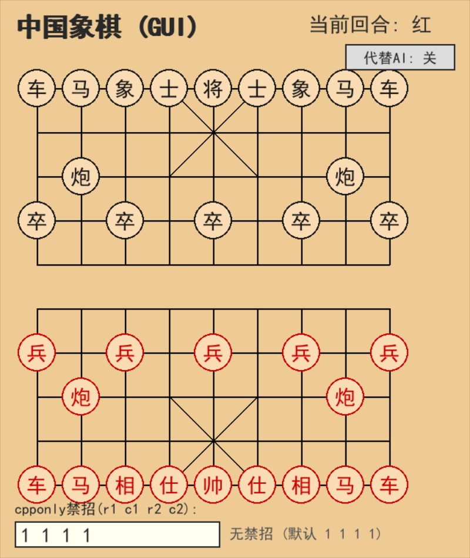
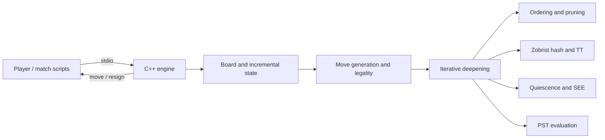
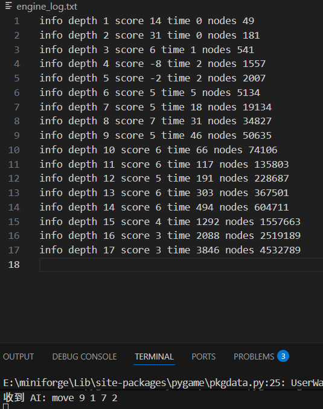

# Thinking a Few Moves Ahead: The Evolution of a Hobby Xiangqi AI

[English](XIANGQI_AI_SHARE.md) · [简体中文](XIANGQI_AI_SHARE_zh.md)

Audience: developers interested in the project. Suggested format: 30-minute talk plus 10-minute discussion. Core source: [xiangqi_ai.cpp](xiangqi_ai.cpp).

> Historical talk: this describes the PST-era engine and the checks performed when the original talk was prepared. The current NNUE system is documented in the [README](README.md).

## Opening: a search engine learns to play

This C++ Xiangqi engine's original version uses neither a language model nor a trained neural network. It enumerates moves, assumes both sides choose favorable replies, explores as deeply as time permits, and returns its best completed answer.

The central question is: **within the same second, how can we spend less effort on irrelevant branches and examine important lines more deeply?**



## 1. How the project grew

| Date | Milestone | Problem addressed |
|---|---|---|
| 2026-02-07 | First commits | Working Python prototype |
| 2026-02-10 | Attempt to learn PST | Position/score-based table learning did not meet expectations |
| 2026-02-11 | Phase and attacking PST experiments | Explore placement values, drawing on ElephantEye |
| 2026-02-11 | Check extensions and futility experiments | Determine search gains through matches |
| 2026-02-11 | King-location/check-detection optimization | Incremental state and direct attack detection |
| 2026-02-11 | Horse-leg coordinate fix | Repair a Xiangqi rule error |
| 2026-02-12 | Usable C++ version | Migrate the core |
| 2026-05-26 | Search/data-structure optimization | Self-tests beat fixed-depth-7 Pikafish |
| 2026-08-21 | A/B self-play | Validate changes through color-swapped matches |

AI-assisted implementation is fast; rules, search boundaries, and experimental conclusions still need verification. A horse-leg coordinate bug can leave the program running and playing while silently corrupting legality.

## 2. From interface to search tree


```mermaid
flowchart LR
    U[Player / match scripts] -->|stdio| E[C++ engine]
    E --> B[Board and incremental state]
    B --> G[Move generation and legality]
    G --> S[Iterative deepening]
    S --> O[Ordering and pruning]
    S --> T[Zobrist hash and TT]
    S --> Q[Quiescence and SEE]
    S --> V[PST evaluation]
    E -->|move / resign| U
```

The historical core was about 1,767 lines. `gui.py` provides pygame, `webapp.py` provides FastAPI/WebSocket, and `selfplay.py`, `ab_selfplay.py`, and `cross_arena.py` provide matches.

```text
ready
side red
move 7 7 4 7
search
```

Typical replies:

```text
readyok
move 2 1 2 4
```

This protocol lets clients and experiments use the engine without depending on search internals.

## 3. Representing a position

```cpp
char board[10][9];
```

Uppercase denotes Red, lowercase Black, and dots empty squares:

```text
r n b a k a b n r
. . . . . . . . .
. c . . . . . c .
p . p . p . p . p
...
R N B A K A B N R
```

Millions of make/search/undo operations also maintain `current_score`, `current_hash`, `king_pos`, piece lists, rank/file and side occupancy masks, and path positions/moves/check records. Update only affected squares rather than repeatedly scanning 90 squares. Every value changed by `make_move()` must be restored by `undo_move()`; otherwise later branches inherit corrupted state.

## 4. Xiangqi rules need explicit tests

Horses have blocked legs; elephants have blocked eyes and cannot cross the river; cannons require exactly one screen to capture; kings stay in the palace and cannot face each other; pawns gain sideways movement after crossing.

Generate pseudo-legal moves first, then make each move and reject self-check. Rook/cannon attacks use precomputed occupancy tables:

```cpp
uint16_t ROOK_ROW_ATT[9][512];
uint16_t ROOK_COL_ATT[10][1024];
uint16_t CANNON_ROW_ATT[9][512];
uint16_t CANNON_COL_ATT[10][1024];
```

The horse-leg bug compiled successfully and affected only specific checking patterns. Testing must cover special rules and tactical positions, not just whether the engine returns a move.

## 5. Evaluating a position

```cpp
int evaluate() { return current_score; }
```

The work happens during moves:

```cpp
int total = val + pst_val;
return red ? total : -total;
```

PST expresses placement preferences: advanced pawns, active horses, and king safety within the palace. This historical evaluator is incremental and hand-designed. The optional ChessDB opening book belongs to the client layer, defaults off, and falls back to search on a miss. PST is cheap but captures limited knowledge of structures, attacks, cooperation, and endgames.

## 6. Minimax considers the opponent

Red maximizes, Black minimizes, and depth-limited leaves use static evaluation. With a hypothetical branching factor of 35, depth 1 has 35 nodes, depth 2 has 1,225, depth 4 has 1,500,625, and depth 6 roughly 1.8 billion. Real captures, checks, and pruning change the count but not the underlying exponential growth.

Search gains come from proving that many branches cannot change the choice.

## 7. Alpha-beta changes the scale

Alpha is the score Red can already guarantee; beta is the bound Black can already enforce. Stop branches that cannot affect an ancestor's choice. Full Minimax results are preserved, while ordering strongly affects speed.

The engine orders using TT best moves, captures and SEE, killer moves, counter moves, and history. Better guesses about move order can increase reachable depth without changing the evaluator.

## 8. The rest of the search stack

**Iterative deepening** searches 1, 2, 3… and retains completed results, improving ordering and narrowing windows.

**Zobrist hashing and TT** identify positions with 64-bit keys and store depth, bounds, and best moves. The configuration has `2^23` slots, about eight million.

**Quiescence search** continues forcing captures and checks so evaluation does not stop between a capture and its recapture.

**SEE** cheaply estimates exchanges on one target square. Debugging includes checking that attackers and occupancy update correctly as exchanges reveal lines.

**Selective techniques** include null move, LMR, LMP, futility/reverse futility, razoring, IID, aspiration windows, and PVS re-search. They allocate less effort to apparently unimportant branches, with recovery where appropriate. Reduced node counts require match validation before being interpreted as stronger play.

## 9. Repetition and perpetual check

```cpp
uint64_t path_hashes[PATH_CAP];
Move path_moves[PATH_CAP];
bool path_gave_check[PATH_CAP];
```

The engine records the path and checks whether one side checked on every move of a cycle, assigning a loss to the perpetual checker. This is a simplified rule set: complete perpetual chase, mating-threat cycles, and complex Asian-rule adjudication remain outside this version.

## 10. Did the optimization help?

Paired A/B matches compare baseline and candidate with identical compilers/flags, several time controls, both colors, full logs, and summary JSON.

The historical `ab_results/matecheck/summary.json` recorded **2 wins, 7 draws, 1 loss, 0 errors**, for **55% score** in ten games. It screened for obvious crashes or severe regression. Seven draws hit the 160-ply limit; a fixed initial position and deterministic search make samples correlated. This small result does not establish a significant strength gain. Elo estimation needs varied legal openings, many pairs, and intervals.

| Change | Validation |
|---|---|
| Equivalent optimization | Fixed-position moves, scores, nodes, profiling/time |
| Search strategy | Color-swapped matches across time controls; tactical regression |
| Evaluation | Many games from diverse openings |
| Rule fix | Targeted position and protocol tests |

## 11. Checks performed for the original talk

The original preparation rebuilt `xiangqi_ai.cpp`, passed a `ready / print / quit` smoke check, and tested illegal web moves, resignation/process cleanup, concurrency limits, and idle cleanup. The recorded pytest result was **4 passed**; three long real-engine cases were omitted from that quick run. This is historical validation, not a claim about checks performed during translation.

## 12. Lessons

Correct rules and undo state make search improvements meaningful. Data structures determine the cost of operations repeated millions of times. Every optimization needs a hypothesis and a matching check. AI assistance accelerates implementation while making position tests, logs, and review essential. GUI, protocols, profiling, and self-play are part of the project, not incidental extras.

## 13. Historical limitations

PST offered limited positional/attacking knowledge; repetition rules were incomplete; A/B samples were small and correlated. The monolithic core helped experimentation but complicated maintenance. Temporary debugging code remained, core rules/search needed broader unit coverage, and parts of the old README lagged behind the implementation, including its description of two phase-specific PSTs.

## 14. Proposed next steps at the time

Build rule/tactical suites; add make/undo consistency assertions; record fixed-position depth, nodes, scores, and moves; diversify A/B openings; separate search, board, evaluation, and protocol; then explore richer evaluation or NNUE. The current project has since developed the NNUE route documented separately.

## Closing

One request, “make a computer play Xiangqi,” leads to rules, combinatorial growth, caching, bit operations, profiling, experimental design, and interface boundaries. Each change asks a new question: legal moves, useful evaluation, deeper foresight, measured strength, or reproducibility. A hobby project can grow by making these questions increasingly precise.

## Live demonstrations

```powershell
.\xiangqi_ai.exe
ready
print
side red
search
quit
```

`side` names the human side: `side red` makes the engine Black. Open `engine_log.txt` to explain depth, score, time, and nodes across iterative deepening. Then inspect the historical A/B summary and discuss what its 55% score supports.



## Discussion prompts

1. What is the smallest useful experiment for a search optimization?
2. How should make/undo be property-tested or fuzzed?
3. When should regression tests fix time versus depth?
4. Which test should come first: rules, tactics, or large self-play?
5. Where is the next investment most useful: evaluation, search, or modularity?
