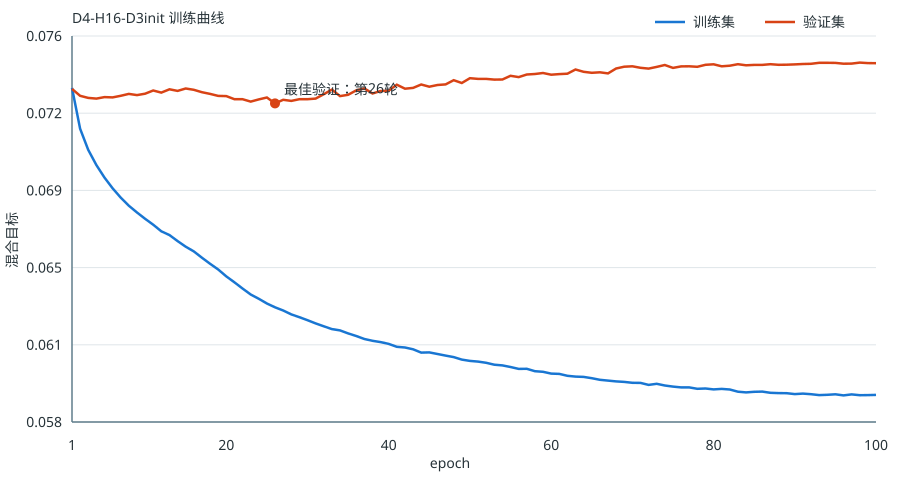

# Xiangqi NNUE：设计、训练与验证

本目录只记录完整象棋 AI 系统中的 **NNUE 评价专题**；规则、搜索、客户端、实验框架和教程的总览见仓库根 [`README.md`](../README.md)。最终 NNUE 交付是 `D4-H16（D3 初始化）`：363KB 的量化残差网络，已接入与 PST 相同的搜索和网页协议。

## 1. 最终结果

统一条件：192 个保留开局，每个开局交换红黑，共384盘；每步0.10秒；最长160 ply；每个对局进程固定到一个逻辑 CPU；置信区间以“开局对”而非单盘为抽样单位。

| 直接对抗 | 胜/和/负 | 得分率 | 配对95% CI |
|---|---:|---:|---:|
| **D4-H16-D3init vs PST** | **172 / 115 / 97** | **59.77%** | **56.38%–63.15%** |
| **D4-H16-D3init vs D4-H8-D3init** | **149 / 118 / 117** | **54.17%** | **50.26%–58.07%** |

逐项摘要见 [`direct_match_summary.json`](direct_match_summary.json)。8模型、5轮瑞士制的完整排名见 [`swiss_8models_5rounds.json`](swiss_8models_5rounds.json)。由这些JSON自动生成的汇总见 [`RESULTS.generated.md`](RESULTS.generated.md)。



## 2. 网络结构

最终网络预测相对 PST 的 centipawn 残差，而不是完全替代 PST：

```text
XQ-HalfKA-9x14x90（11,340维稀疏特征）
  → 红/黑双视角共享 11,340×16 特征表
  → 两个 H16 累加器
  → CReLU
  → concat[待走方视角, 对方视角]
  → 中局/残局二选一线性输出头
  → clamp(residual, ±300cp) + PST
```

- 9：己方将帅在九宫中的锚点位置。
- 14：7种棋子 × 己方/敌方。
- 90：棋盘格；黑方视角旋转180度。
- 两视角共享同一特征表；输出头按剩余棋子数20分为中局/残局，但每次只执行一个头。
- 普通走子、吃子和 undo 只加减对应特征行；己方将帅移动时重建受影响的单个视角；null move 不修改累加器。

最终结构没有小隐藏层。实验表明，在当前搜索频繁调用评价的条件下，H16 直接头取得了更好的棋力/速度平衡。

## 3. 教师与数据

### 教师

教师以冻结 PST 作为静态评价，保留完整 Alpha-Beta/PVS、合法 beta cutoff、走法排序、将军延伸和 qsearch；生成标签时关闭可能引入有偏分数的 TT 截断、reverse futility、razoring、null move、late-move/futility/SEE pruning、LMR，以及 qsearch 的负 SEE 捕获过滤。

搜索深度作为超参数而非固定常数。D3 提供更易拟合的大覆盖数据，D4 提供更强但更昂贵的标签；D5 旧方案保留作对照，没有用于最终最佳模型。

### 百万级数据集

| 数据集 | 最终样本 | 待走方 | 划分 |
|---|---:|---:|---:|
| D3 | 1,000,000 | 红500k / 黑500k | 700k / 150k / 150k |
| D4 | 1,000,000 | 红500k / 黑500k | 700k / 150k / 150k |

数据按完整 `board + side-to-move` 全局去重，并按 game id 隔离 train/validation/calibration，避免同局面或同局游戏泄漏。重复组中若只存在一个正常非零、非绝杀教师分，则保留该分；正常教师分互相冲突的组整组丢弃。原始百万数据约108MB/份，因体积与可再生性不提交 Git。

去重统计：

- D3：1,111,298条原始记录 → 1,041,008条有效记录 → 1,040,044个唯一局面；119个无法消解的冲突组丢弃。
- D4：1,178,220条原始记录 → 1,045,306条有效记录 → 1,044,346个唯一局面；46个冲突组丢弃。

## 4. 训练目标与超参数

Sigmoid 温度 `K` 只在 calibration 集上做一维统计拟合，随后冻结；它不是网络参数，也不参与联合优化：

- D3：`K=60.943546`
- D4：`K=56.343903`

网络学习 `teacher - PST` 残差。主目标为冻结 K 下的概率误差，同时加入 cp 空间 SmoothL1，避免 sigmoid 在高绝对分局面饱和后退化成近零残差。

| 参数 | 值 |
|---|---:|
| width / hidden | 16 / 0 |
| activation | CReLU |
| epochs | 100（按最佳验证 checkpoint 导出） |
| best epoch | 26 |
| batch size | 8192 |
| optimizer | AdamW + cosine schedule |
| initial LR | 0.003 |
| search/result lambda | 0.95 / 0.05 |
| delta loss weight | 0.25 |
| delta clip / Huber beta | 250 / 25 cp |
| seed | 79808 |
| initialization | D3-H16 最佳 checkpoint，按 K 比例重标输出层 |

主要验证集结果（机器可读来源为 [`model_comparison.json`](model_comparison.json)）：

| 模型 | 概率MSE | teacher MAE(cp) | 残差相关系数 |
|---|---:|---:|---:|
| D3-H8 | 0.007843 | 18.67 | 0.345 |
| D3-H16 | 0.007707 | 18.60 | 0.366 |
| D4-H8 random | 0.010372 | 22.16 | 0.446 |
| D4-H8 D3-init | 0.010630 | 22.12 | 0.411 |
| D4-H16 random | 0.010042 | 22.17 | 0.467 |
| **D4-H16 D3-init** | **0.009906** | **22.08** | **0.473** |
| D4 PST-only | 0.012926 | 24.73 | — |

离线指标用于筛选而不是代替实战；最终选择依据是量化后、等时、换先配对比赛。

## 5. 定点推理与正确性

- 特征权重/偏置使用固定 Q12，累加器为 int32。
- 输出层折入冻结 K 后使用安全的二次幂 scale；最终模型输出 scale 为128。
- 输出 dot/bias 使用 int64，只做一次带符号定点除法；C++ 热路径不执行 sigmoid。
- 模型文件包含 magic、版本、结构尺寸和元数据，加载失败会明确报错；不加载模型时安全回退 PST。

正确性门槛：

- 822,487次随机合法 make/undo/null/rebuild 转换中，增量累加器与全量重算逐元素一致。
- 覆盖吃子、将帅移动、撤销、null move、setboard，以及旋转180度并交换红黑后的反对称检查。
- 最终量化模型在30k D4验证子集上：MAE 22.01cp、RMSE 41.19cp、相关系数0.493、`|target|>=20`符号正确率81.5%。
- NNUE未加载时与 PST 公平版本在固定深度下着法、分数、节点数一致，排除搜索代码漂移。

## 6. 实验结论

1. **数据覆盖优先于一味加深教师**：百万级、红黑平衡 D3/D4 比旧15万单边数据更有效。
2. **更深标签不等于更强学生**：旧 D5-H8 在瑞士制中为48.13%，最终 D4-H16明显更好。
3. **课程初始化对实战有价值**：D4 的随机初始化和 D3 初始化离线差距不大，但 D3-init H16 在直接比赛中胜出。
4. **H16值得其成本**：对 H8 直接得分54.17%，平均完成深度仅9.18 vs 9.24，速度差很小。
5. **必须量化后等时比较**：只看 MSE 会忽略累加器维护和输出头降低搜索深度的代价。

## 7. 关键文件

| 文件 | 用途 |
|---|---|
| [`nnue_engine.cpp`](nnue_engine.cpp) | NNUE特征、增量累加器、量化推理和搜索协议 |
| [`train.py`](train.py) | K校准、训练、D3初始化和v3模型导出 |
| [`generate_data.cpp`](generate_data.cpp) | 教师自对弈数据生成 |
| [`build_balanced_dataset.py`](build_balanced_dataset.py) | 去重、冲突消解、红黑平衡和固定切分 |
| [`verify_nnue.cpp`](verify_nnue.cpp) | 增量状态与对称性验证 |
| [`validate_quant.cpp`](validate_quant.cpp) | Python/C++量化输出统计验证 |
| [`engine_match.py`](engine_match.py) | 任意两模型换先配对比赛 |
| [`swiss_tournament.py`](swiss_tournament.py) | 8模型并行瑞士轮 |
| [`openings_final2_192.fen`](openings_final2_192.fen) | 最终统一保留开局 |
| [`d4_balanced1m_h16_fromd3_full100_gpu.nnue`](d4_balanced1m_h16_fromd3_full100_gpu.nnue) | 最佳量化权重 |
| [`artifacts.json`](artifacts.json) | 模型、数据、源码的版本与SHA-256清单 |
| [`report_results.py`](report_results.py) | 从JSON重建结果表和SVG训练曲线 |

## 8. 构建与使用

```powershell
# 引擎
g++ -O3 -std=c++17 -march=native -DNDEBUG `
  -o trainnnue/nnue_engine.exe trainnnue/nnue_engine.cpp

# 正确性验证器
g++ -O3 -std=c++17 -march=native -DNDEBUG `
  -o trainnnue/verify_nnue.exe trainnnue/verify_nnue.cpp

trainnnue/verify_nnue.exe `
  trainnnue/d4_balanced1m_h16_fromd3_full100_gpu.nnue

# 启动最佳引擎
trainnnue/nnue_engine.exe `
  --nnue trainnnue/d4_balanced1m_h16_fromd3_full100_gpu.nnue `
  --nnue-blend 1
```

训练示例（数据集需自行生成）：

```powershell
python trainnnue/train.py trainnnue/train_depth4_balanced_1m_v2.bin `
  --output trainnnue/model.nnue --device cuda `
  --width 16 --hidden 0 --activation crelu --phase-heads `
  --epochs 100 --batch-size 8192 --learning-rate 0.003 `
  --lambda 0.95 --residual --delta-weight 0.25 `
  --delta-clip 250 --delta-beta 25 --seed 79808 `
  --init-nnue trainnnue/d3_balanced1m_h16_full100_gpu.nnue
```

重新生成已提交的关键表格和图：

```powershell
python trainnnue/report_results.py
git diff --exit-code -- trainnnue/RESULTS.generated.md trainnnue/training_curve.svg
```

脚本只依赖Python标准库；若结果JSON发生变化，生成文件也必须随之更新。

## 9. 适用边界

这些比赛证明当前模型在指定机器、搜索框架、开局套件和时间控制下优于 PST，但不等同于跨平台大样本 Elo 标定。引擎沿用原有重复局面与简化长将规则，尚未实现完整平台级长捉/长杀裁决。
