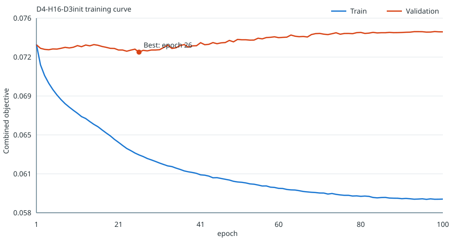
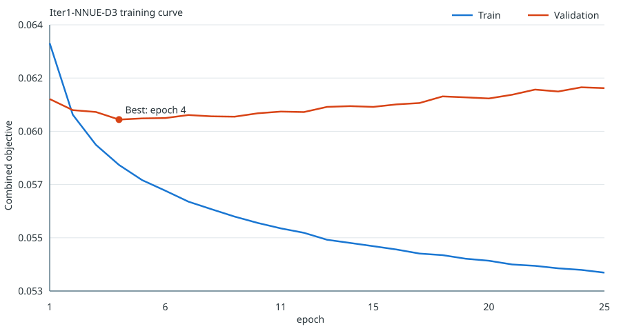
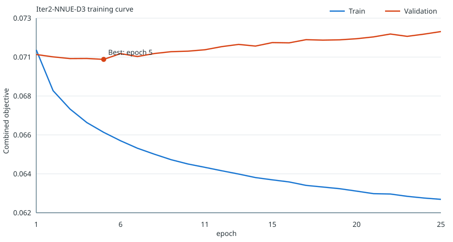
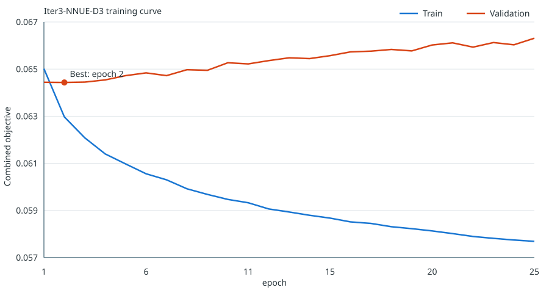

# Xiangqi NNUE: Design, Training, and Validation

[English](README.md) · [简体中文](README_zh.md)

This directory covers **NNUE evaluation** within the complete Xiangqi system. See the [root README](../README.md) for rules, search, clients, and the tutorial. `Iter2-NNUE-D3` scores **70.18%** against the PST baseline. Results against ElephantEye, Tianqi, and Cyclone place it around **2400 Elo on the cited reference scale**.

## 1. Results

### External engines

Each match uses 180 color-swapped opening pairs (360 games), with both engines pinned to the same logical CPU per game. Implied ratings use `opponent reference Elo + 400 × log10(score / (1 − score))`, with anchors from a [public Xiangqi engine rating list](https://zhuanlan.zhihu.com/p/2072972857840350627).

| Opponent | Our W / D / L (score rate) | Implied Elo |
|---|---:|---:|
| [ElephantEye 3.1](iter2_vs_eleeye31_180pairs.json) | 290 / 31 / 39 (84.86%) | ≈2430 |
| [Tianqi V1.1.8](iter2_vs_tianqi118_180pairs.compact.json) | 109 / 79 / 172 (41.25%) | ≈2369 |
| [Cyclone 2007C](iter2_vs_cyclone2007c_180pairs.compact.json) | 60 / 95 / 205 (29.86%) | ≈2452 |
| [Pikafish 2026-01-31 · UCI_Elo=1900](iter2_vs_pikafish_elo1900_180pairs.json) | 169 / 68 / 123 (56.39%) | ≈1945 (limited-strength scale) |
| [Pikafish 2026-01-31 · full strength](iter2_vs_pikafish_official_180pairs.json) | 6 / 44 / 310 (7.78%) | ≈3573 (cross-generation comparison) |


The historical opponents imply **2369–2452 Elo**, around human-master level on the reference scale. Pikafish provides modern limited-strength and full-strength comparisons. Mean measured times (ours / opponent): ElephantEye 104.0 / 119.4 ms; Tianqi 155.0 / 159.6 ms; Cyclone 112.4 / 89.9 ms; Pikafish 1900 76.2 / 101.3 ms; full strength 86.9 / 91.4 ms. Our engine used about 25% more time against Cyclone.

Reproduce with [ElephantEye](run_eleeye_match.ps1), [Tianqi](run_tianqi_match.ps1), [Cyclone](run_cyclone_match.ps1), and [Pikafish](run_external_match.ps1) pipelines. Per-game JSON preserves openings, colors, outcomes, search statistics, hashes, and paired bootstrap intervals. [compact_match_result.py](compact_match_result.py) condenses the full Cyclone/Tianqi legality audits into committed records.

### Internal comparisons

All comparisons use 192 held-out openings, colors swapped (384 games), 0.10 seconds per move, a 160-ply limit, and one logical CPU per game process. Confidence intervals resample opening pairs.

| Match | W / D / L | Score rate | Paired 95% CI |
|---|---:|---:|---:|
| Iter3 vs Iter2 | 132 / 142 / 110 | 52.86% | 49.35%–56.38% |
| Iter3 vs PST | 224 / 90 / 70 | 70.05% | 66.67%–73.44% |
| Iter2 vs Iter1 | 143 / 137 / 104 | 55.08% | 51.43%–58.72% |
| **Iter2 vs PST** | **218 / 103 / 63** | **70.18%** | **66.80%–73.44%** |
| Iter1 vs D4-H16-D3init | 174 / 120 / 90 | 60.94% | 57.16%–64.71% |
| Iter1 vs PST | 188 / 110 / 86 | 63.28% | 59.51%–66.93% |
| D4-H16-D3init vs PST | 172 / 115 / 97 | 59.77% | 56.38%–63.15% |
| D4-H16-D3init vs D4-H8-D3init | 149 / 118 / 117 | 54.17% | 50.26%–58.07% |

See [direct summaries](direct_match_summary.json), the [eight-model, five-round Swiss tournament](swiss_8models_5rounds.json), and the [generated report](RESULTS.generated.md).







PST is the 50% baseline. Generations 1–4 score 59.77%, 63.28%, 70.18%, and 70.05% under the same protocol. Generation 1 uses one million positions each from PST D3 and D4; generations 2–4 each use one million from previous-NNUE D3 search. The observed peak is generation 3, named Iter2 in filenames.

## 2. Architecture

The network predicts a centipawn residual relative to PST:

```text
XQ-HalfKA-9x14x90 (11,340 sparse features)
  → shared 11,340×16 feature table for Red/Black perspectives
  → two H16 accumulators
  → CReLU
  → concat[side-to-move perspective, opponent perspective]
  → one selected middlegame/endgame linear output head
  → clamp(residual, ±300cp) + PST
```

Dimensions: 9 palace king anchors, 14 channels (seven types × friendly/enemy), and 90 squares. Black's view rotates 180 degrees. Both perspectives share weights. A 20-piece threshold selects a phase head; only one head runs per evaluation.

Moves, captures, and undo add/subtract feature rows. King moves rebuild the affected perspective; null moves leave accumulators unchanged. There is no additional hidden layer: H16 with a direct head gave the best observed strength/speed balance.

## 3. Teachers and datasets

Teachers use frozen PST or specified quantized NNUE. Both retain alpha-beta/PVS, valid beta cutoffs, ordering, check extensions, and quiescence. Label generation disables TT score cutoffs, reverse futility, razoring, null move, late-move/futility/SEE pruning, LMR, and negative-SEE filtering in quiescence.

Depth is a hyperparameter: D3 is cheaper and easier to fit; D4 gives stronger, costlier labels. Historical D5 is retained for comparison but excluded from the selected model. Use `--teacher pst|nnue`; PST is the compatible default. NNUE also requires `--nnue MODEL`.

Each D3, D4, Iter1, Iter2, and Iter3 dataset has **1,000,000** positions: Red 500k / Black 500k, split **700k / 150k / 150k** for training / validation / calibration. Deduplicate globally by `board + side-to-move` and split by game ID. Keep a duplicate group's unique normal nonzero, non-mate score; discard groups with conflicting normal scores. Each dataset is about 108 MB and is regenerated rather than committed.

| Dataset | Raw | Valid | Unique | Discarded conflict groups |
|---|---:|---:|---:|---:|
| D3 | 1,111,298 | 1,041,008 | 1,040,044 | 119 |
| D4 | 1,178,220 | 1,045,306 | 1,044,346 | 46 |
| Iter1 | 1,194,941 | 1,102,045 | 1,101,430 | 12 |
| Iter2 | 1,181,556 | 1,058,557 | 1,057,865 | 15 |
| Iter3 | 1,200,622 | 1,091,222 | 1,090,445 | 19 |

Iter3 also resolves two historical zero-score conflicts using the unique normal score.

## 4. Objective and training

Calibrate sigmoid temperature K separately, then freeze it: D3 **60.943546**, D4 **56.343903**, Iter1 **60.667468**, Iter2 **54.708417**, Iter3 **61.309585**. It is not jointly optimized with network weights.

Learn `teacher − PST` with fixed-K probability error plus centipawn SmoothL1 loss, avoiding near-zero residuals caused by sigmoid saturation at large scores.

| Parameter | D4-H16-D3init |
|---|---|
| Width / hidden | 16 / 0 |
| Activation | CReLU |
| Epochs / best epoch | 100 / 26; export best validation checkpoint |
| Batch | 8192 |
| Optimizer | AdamW + cosine schedule |
| Initial LR | 0.003 |
| Search / result lambda | 0.95 / 0.05 |
| Delta weight | 0.25 |
| Delta clip / Huber beta | 250 / 25 cp |
| Seed | 79808 |
| Initialization | Best D3-H16 checkpoint; rescale output by K ratio |

| Model | Probability MSE | Teacher MAE (cp) | Residual correlation |
|---|---:|---:|---:|
| D3-H8 | 0.007843 | 18.67 | 0.345 |
| D3-H16 | 0.007707 | 18.60 | 0.366 |
| D4-H8 random | 0.010372 | 22.16 | 0.446 |
| D4-H8 D3-init | 0.010630 | 22.12 | 0.411 |
| D4-H16 random | 0.010042 | 22.17 | 0.467 |
| D4-H16 D3-init | 0.009906 | 22.08 | 0.473 |
| D4 PST-only | 0.012926 | 24.73 | — |

Source: [model_comparison.json](model_comparison.json). Offline metrics screen candidates; quantized equal-time paired matches determine selection.

**Iter1** starts from D4-H16; maximum 150 epochs, minimum 25, patience 15. Best validation: epoch 4; early stop: 25. Validation probability MSE 0.007689, MAE 20.60 cp, correlation 0.643. Quantized MAE on 30k positions: 20.45 cp.

**Iter2** uses Iter1 as teacher and initialization. Best epoch 5, stop at 25. Validation MSE 0.009012, MAE 21.78 cp, correlation 0.711. Quantized 30k-position MAE 21.63 cp, correlation 0.726.

**Iter3** uses Iter2 for both roles. Minimum observed objective: epoch 2; `min_delta=1e-5` selects the nearly identical epoch-1 checkpoint. Stop at 25. Quantized 30k-position MAE 22.78 cp, correlation 0.751.

Iter3 scores 52.86% against Iter2 with an interval spanning 50%. Against PST it scores 70.05%, down 0.13 points. The predeclared rule stops at the first decline in the PST point estimate: no Iter4, retain Iter2. Overlapping intervals support a plateau, not a statistically established strength loss.

## 5. Fixed-point inference

Feature weights/biases use Q12 with int32 accumulators. Output weights fold in K and use a safe power-of-two scale (128 for the final model). Dot products/biases use int64 and one signed fixed-point division. No sigmoid runs in the C++ hot path.

Files include magic, version, dimensions, and metadata. Invalid loads report errors; running without a model falls back to PST. The initial D4 quantized model's 30k validation metrics: MAE 22.01 cp, RMSE 41.19 cp, correlation 0.493, and 81.5% sign accuracy for `|target|>=20`. These describe fit; paired games determine selection.

## 6. Findings

1. Million-position, side-balanced D3/D4 data improves on the old 150k one-sided setup.
2. Deeper teachers can produce weaker students: historical D5-H8 scored 48.13% in the Swiss tournament.
3. D3 initialization benefits D4 matches despite modest offline differences.
4. H16 earns its cost: 54.17% against H8, mean depth 9.18 vs 9.24.
5. Quantized equal-time matches include inference costs that offline MSE misses.
6. Iteration reaches a plateau: 59.77% → 63.28% → 70.18% → 70.05% against PST. Iter2 is the observed peak; the final small decline meets the stopping rule without establishing a true regression.

## 7. Key files

| File | Purpose |
|---|---|
| [nnue_engine.cpp](nnue_engine.cpp) | Features, accumulators, inference, protocol |
| [train.py](train.py) | K calibration, training, initialization, v3 export |
| [generate_data.cpp](generate_data.cpp) | Teacher self-play |
| [build_balanced_dataset.py](build_balanced_dataset.py) | Deduplication, conflicts, balance, splits |
| [verify_nnue.cpp](verify_nnue.cpp) | Incremental state and symmetry |
| [validate_quant.cpp](validate_quant.cpp) | Python/C++ quantization checks |
| [engine_match.py](engine_match.py) | Paired matches |
| [swiss_tournament.py](swiss_tournament.py) | Eight-model Swiss tournament |
| [openings_final2_192.fen](openings_final2_192.fen) | Held-out openings |
| [artifacts.json](artifacts.json) | Versions and SHA-256 |
| [report_results.py](report_results.py) | Tables and SVG plots |
| [merge_match_shards.py](merge_match_shards.py) | Merge shards and recompute CI |
| [iter1_experiment.json](iter1_experiment.json) | First iteration summary |
| [iter2_experiment.json](iter2_experiment.json) | Second iteration summary |
| [iter3_experiment.json](iter3_experiment.json) | Stopping evidence |
| [d4_balanced1m_h16_fromd3_full100_gpu.nnue](d4_balanced1m_h16_fromd3_full100_gpu.nnue) | Historical D4 baseline |
| [iter1_nnued3_h16_fromd4_gpu.nnue](iter1_nnued3_h16_fromd4_gpu.nnue) | Iter1 model |
| [iter2_nnued3_h16_fromiter1_gpu.nnue](iter2_nnued3_h16_fromiter1_gpu.nnue) | Selected deployed model |
| [iter3_nnued3_h16_fromiter2_gpu.nnue](iter3_nnued3_h16_fromiter2_gpu.nnue) | Plateau probe |
| [run_teacher_iteration.ps1](run_teacher_iteration.ps1) | Resumable generation, training, validation, matches |
| [run_until_regression.ps1](run_until_regression.ps1) | Repeated iterations with stopping rule |

## 8. Build and reproduce

Build the engine and correctness checker, then start the selected model:

```powershell
# Engine
g++ -O3 -std=c++17 -march=native -DNDEBUG `
  -o trainnnue/nnue_engine.exe trainnnue/nnue_engine.cpp

# Correctness checker
g++ -O3 -std=c++17 -march=native -DNDEBUG `
  -o trainnnue/verify_nnue.exe trainnnue/verify_nnue.cpp

trainnnue/verify_nnue.exe `
  trainnnue/d4_balanced1m_h16_fromd3_full100_gpu.nnue

# Start the deployed model
trainnnue/nnue_engine.exe `
  --nnue trainnnue/iter2_nnued3_h16_fromiter1_gpu.nnue `
  --nnue-blend 1
```

Train after regenerating the dataset:

```powershell
python trainnnue/train.py trainnnue/train_depth4_balanced_1m_v2.bin `
  --output trainnnue/model.nnue --device cuda `
  --width 16 --hidden 0 --activation crelu --phase-heads `
  --epochs 100 --batch-size 8192 --learning-rate 0.003 `
  --lambda 0.95 --residual --delta-weight 0.25 `
  --delta-clip 250 --delta-beta 25 --seed 79808 `
  --init-nnue trainnnue/d3_balanced1m_h16_full100_gpu.nnue
```

Select a teacher (PST remains the default):

```powershell
# Original PST teacher
trainnnue/generate_data.exe shard.bin 1000 3 83000 120 2 6 1 8000000

# Quantized NNUE teacher with D3 search
trainnnue/generate_data.exe shard.bin 1000 3 83000 120 2 6 1 8000000 `
  --teacher nnue --nnue trainnnue/iter1_nnued3_h16_fromd4_gpu.nnue
```

Run external engines you have supplied locally:

```powershell
trainnnue/run_eleeye_match.ps1 `
  -EleeyePath "D:\engines\ElephantEye31\ELEEYE.EXE" -Force

trainnnue/run_cyclone_match.ps1 `
  -CyclonePath "D:\engines\Cyclone2007C\cyclone.exe" `
  -XqSecondsPerMove 0.31 -CycloneSecondsPerMove 0.10 -Force

trainnnue/run_tianqi_match.ps1 `
  -TianqiPath "D:\engines\Tianqi118\Tianqi.exe" `
  -OpeningPairs 180 -OpeningStart 12 `
  -XqSecondsPerMove 0.46 -TianqiSecondsPerMove 0.10 -Force
```

Regenerate committed tables and figures:

```powershell
python trainnnue/report_results.py
git diff --exit-code -- trainnnue/RESULTS.generated.md `
  trainnnue/training_curve.svg trainnnue/iter1_training_curve.svg `
  trainnnue/iter2_training_curve.svg trainnnue/iter3_training_curve.svg `
  trainnnue/iteration_vs_pst.svg trainnnue/external_benchmark.svg
```

Cyclone 2007C uses the early `fen ...` UCI dialect; ElephantEye 3.1 uses UCCI; Tianqi V1.1.8 uses standard UCI. The runner validates every move and bootstraps opening pairs for 95% intervals. Reporting uses only the Python standard library; regenerate outputs whenever result JSON changes.

## 9. Scope and next steps

Results apply to the recorded single-threaded setup, opening set, 160-ply limit, and current repetition rules. Pikafish 1900 is its built-in UCI scale. Further work will repeat multiple time controls and add complete perpetual-chase and perpetual-mating-threat adjudication.
